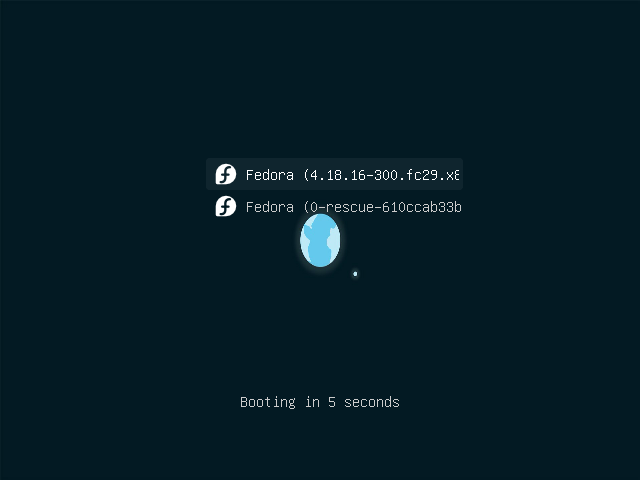

# Bhoomi (ಭೂಮಿ ) Grub2 Theme

This theme is based on [Vimix](https://github.com/vinceliuice/grub2-themes/tree/master/grub-theme-vimix) Grub2 theme.

[](https://github.com/tprasadtp/bhoomi-grub-theme)


## Preview



Please note that the screenshot was taken on a VM which doesn't support high resolution during bootup.
Background is optimized for wider aspect ratio and looks a little distorted in this preview.

## Installation

To install this,

0. Make backups of `/etc/default/grub` and `/boot/<grub/grub2>/grub.cfg`.
1. Download the [Zip file](https://github.com/tprasadtp/bhoomi-grub-theme/archive/master.zip).
2. Unpack it to your working directory.
3. Copy **ONLY** the contents of folder `bhoomi` to `/boot/grub/themes/bhoomi`
    ```console
    sudo mkdir -p /boot/grub/themes/bhoomi
    sudo cp ./bhoomi-grub-theme/bhoomi /boot/grub/themes/
    ```
4. Open default Grub config as `root`
    ```console
    sudo nano /etc/default/grub
    ```
5. Change (or add if not already present) the following lines & save the file.
    ```console
    # Theme Modifications for file /etc/default/grub
    GRUB_THEME="/boot/grub/themes/bhoomi/theme.txt"
    GRUB_BACKGROUND="/boot/grub/themes/bhoomi/background.jpg"
    ```
6. Re-generate Grub config. `sudo update-grub`. The output should show, theme and background are found, if not check your config and files.
7. Reboot!

## Additional notes for Fedora and OpenSuse [Aslo applies to RedHat, Suse, CentOS, Scientific Linux]

The folder `/boot/grub2` is used in these cases to store grub configurations. replace `grub` with `grub2` in the paths mentioned above.
Also, `update-grub` is not available on these systems(by default). You can use `grub2-mkconfig` to update the Grub config.

If using BIOS,
```console
sudo grub2-mkconfig -o /boot/grub2/grub.cfg
```

for UEFI,
```console
sudo grub2-mkconfig -o /boot/efi/EFI/<distro>/grub.cfg
```

## Problems?

1. I still cannot see `Found theme: /boot/grub2/themes/bhoomi/theme.txt` while genarating grub config.
    - You might have something like `GRUB_TERMINAL_OUTPUT="console"` in `/etc/default/grub`. Remove it or comment that line and theme should be recognized.
    - This is usually the case with Fedora and CentOS.
2. Other Problems?
    - [Open an issue.](https://github.com/tprasadtp/bhoomi-grub-theme/issues/new)

## Changes from the original

Removed Install scripts, Changed fonts to _Ubuntu Regular_ and changed background.

## License

- GNU General Public License v3.0 except for the [Ubuntu fonts](https://github.com/tprasadtp/bhoomi-grub-theme/blob/master/bhoomi/ubuntu-regular-16.pf12). Included Ubuntu fonts are distributed under [Ubuntu font licence](https://assets.ubuntu.com/v1/81e5605d-ubuntu-font-licence-1.0.txt).
- Please do not upload this theme to Gnome-Looks website without changing _at-least_ name of the theme.

## Why Bhoomi?

[ಭೂಮಿ](https://kn.wikipedia.org/wiki/%E0%B2%AD%E0%B3%82%E0%B2%AE%E0%B2%BF) in [Kannada/ಕನ್ನಡ](https://en.wikipedia.org/wiki/Kannada) means "Earth", you know [the pale blue dot ](https://en.wikipedia.org/wiki/Pale_Blue_Dot) we live on. :earth_americas: :earth_africa: :earth_asia: :point_down:

[](https://en.wikipedia.org/wiki/Family_Portrait_(Voyager))


[](https://prasadt.com/google-analytics-beacon)
